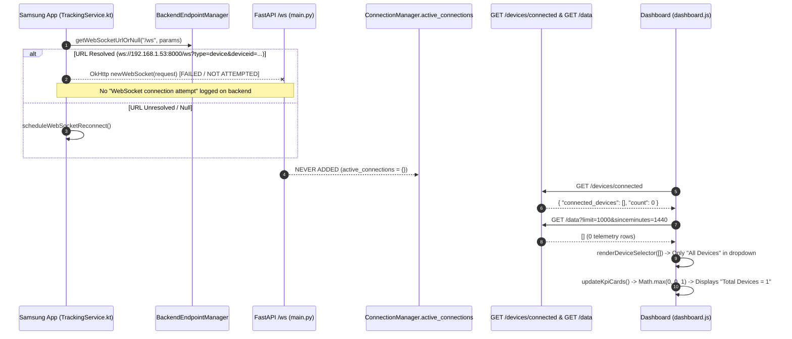

# Watchmen Tracker — Device Connection Diagnosis

## 1. Executive Summary

- **Is Samsung HTTP-connected?** **YES (CONFIRMED WORKING).** The Samsung device (`192.168.1.61`) successfully communicates with the backend (`192.168.1.53:8000`) for HTTP endpoints (`GET /health`, `POST /security-alert`, `GET /check-location-request`, `GET /check-announcements`).
- **Is Samsung WebSocket-connected?** **NO.** The Samsung device has **not** established an active WebSocket connection to the backend `/ws` endpoint.
- **Is Samsung present in `active_connections`?** **NO.** `manager.active_connections` is empty (`{}`), resulting in `active_devices=0`.
- **Is `GET /devices/connected` correct?** **YES.** `GET /devices/connected` accurately returns `{"connected_devices": [], "count": 0}` because no device WebSocket is registered in memory.
- **Is dashboard dropdown correct?** **YES.** The dropdown populates from `GET /data?limit=1000&sinceminutes=1440` (telemetry records). Since Samsung has not submitted telemetry points via `POST /telemetry`, `/data` returns `[]`, leaving `#deviceSelector` with only the default `<option value="">All Devices</option>`.
- **Most likely root cause:** **Primary Cause: Category A/B (Android WebSocket is either not initiating or failing to connect due to missing WebSocket endpoint configuration/Android cleartext/security policy). Secondary Cause: KPI Card Fallback Logic (Dashboard `updateKpiCards()` uses `Math.max(..., 1)` which displays `Total Devices = 1` even when 0 devices exist in telemetry or WebSockets).**

---

## 2. Evidence

### CONFIRMED FACTS
1. **HTTP Logs:** Backend Uvicorn logs confirm HTTP requests from Samsung (`192.168.1.61`):
   - `192.168.1.61 - "GET /health HTTP/1.1" 200 OK`
   - `POST /security-alert → 200 OK`
   - `GET /check-location-request?device_id=TEST001_Samsung%20Test_74285b00 → 200 OK`
   - `GET /check-announcements?device_id=TEST001_Samsung%20Test_74285b00 → 200 OK`
2. **Dashboard WebSocket:** Backend accepts dashboard WebSocket (`/ws?type=dashboard`).
3. **Backend Connection Registry Log:** `manager.active_connections` remains empty (`active_devices=0`). `GET /devices/connected` returns `connected_devices: []`.
4. **Backend WS Route Logging:** `backend/main.py` line 2030 logs `🔗 WebSocket connection attempt | type=...` whenever any client attempts to connect to `/ws`. No such log entry exists for `192.168.1.61`.
5. **Dashboard Dropdown Data Source:** [`dashboard.js`](file:///C:/Users/Shreyas-Wakhare/Desktop/WatchmenTracker/backend/static/dashboard.js#L1134) fetches `${BACKEND}/data?limit=1000&sinceminutes=1440` to populate `#deviceSelector`.
6. **Dashboard KPI Card Fallback:** [`dashboard.js`](file:///C:/Users/Shreyas-Wakhare/Desktop/WatchmenTracker/backend/static/dashboard.js#L3310) hard-codes `Math.max(availableDevices.length, connectedDevices.size, 1)`, displaying `1` when both lists are 0.

### INFERENCES
1. Samsung's `TrackingService` is running (confirmed by location & announcement polling), but its OkHttp `WebSocket` client is either in a reconnect loop due to endpoint resolution issues, or blocked by Android OS network policy (e.g. cleartext HTTP/WS policy for non-TLS local IPs).
2. The dropdown is NOT malfunctioning; it correctly reflects 0 telemetry devices returned by `/data`.

---

## 3. End-to-End Connection Flow



---

## 4. Android WebSocket Analysis

- **Source File:** [`app/src/main/java/com/watchmen/tracker/TrackingService.kt`](file:///C:/Users/Shreyas-Wakhare/Desktop/WatchmenTracker/app/src/main/java/com/watchmen/tracker/TrackingService.kt#L509-L573)
- **URL Construction:** [`BackendEndpointManager.getWebSocketUrlOrNull("/ws", mapOf("type" to "device", "deviceid" to deviceId))`](file:///C:/Users/Shreyas-Wakhare/Desktop/WatchmenTracker/app/src/main/java/com/watchmen/tracker/BackendEndpointManager.kt#L133)
  - Constructs: `ws://192.168.1.53:8000/ws?type=device&deviceid=TEST001_Samsung%20Test_74285b00`
- **Connection Trigger:** `connectWebSocket()` is called in `TrackingService.onCreate()` (Line 895) and retried via `scheduleWebSocketReconnect()`.
- **Handshake Payload:** Sends JSON `{"type": "device_handshake", "deviceid": deviceId, "device_id": deviceId, "timestamp": ...}` inside `onOpen()`.
- **Error Handling:** `onFailure()` logs `[WS] Failure: ${t.message} | HTTP response code: ${response?.code}` and triggers `scheduleWebSocketReconnect()`.

---

## 5. Backend WebSocket Analysis

- **Source File:** [`backend/main.py`](file:///C:/Users/Shreyas-Wakhare/Desktop/WatchmenTracker/backend/main.py#L2023-L2056)
- **Route:** `@app.websocket("/ws")`
- **Query Parameter Extraction:**
  - `client_type = ws.query_params.get("type", "dashboard")`
  - `device_id = ws.query_params.get("deviceid")`
- **Registration Call:** `await manager.connect(ws, client_type, device_id)`
- **Disconnect Behavior:** `manager.disconnect(ws, client_type, device_id)` removes device from `self.active_connections` if present.

---

## 6. ConnectionManager Analysis

- **Source File:** [`backend/main.py`](file:///C:/Users/Shreyas-Wakhare/Desktop/WatchmenTracker/backend/main.py#L1826-L1888)
- **Registry Structure:** `self.active_connections: Dict[str, WebSocket] = {}`
- **Lifecycle:**
  1. `connect()` accepts WebSocket, logs `🔌 DEVICE CONNECTED: {device_id}`, adds to `active_connections[device_id] = websocket`, and broadcasts `device_connected` to dashboards.
  2. `disconnect()` verifies matching WebSocket instance, removes key `del self.active_connections[device_id]`, and broadcasts `device_disconnected`.

---

## 7. `/devices/connected` Analysis

- **Endpoint:** `@app.get("/devices/connected")` in [`backend/main.py`](file:///C:/Users/Shreyas-Wakhare/Desktop/WatchmenTracker/backend/main.py#L1935-L1942)
- **Implementation:** Returns `list(manager.active_connections.keys())`.
- **Current Behavior:** Accurately returns `{"connected_devices": [], "count": 0}` because no device WebSocket has registered in memory.

---

## 8. Dashboard Dropdown Analysis

- **Source File:** [`backend/static/dashboard.js`](file:///C:/Users/Shreyas-Wakhare/Desktop/WatchmenTracker/backend/static/dashboard.js#L1132-L1163)
- **Dropdown Populate Function:** `loadDevices()` calls `fetch('/data?limit=1000&sinceminutes=1440')`.
- **Rendering:** `renderDeviceSelector(devices)` maps unique `deviceid` strings from telemetry data into `<option>` tags under `#deviceSelector`.
- **Reason Dropdown is Empty:** When 0 telemetry points exist in the last 24 hours, `devices` is `[]`, leaving `#deviceSelector` with only `<option value="">All Devices</option>`.

---

## 9. Total Devices vs. Connected Devices

Why does the dashboard show **Total Devices = 1** and **Active Tracking = 1** when no device is in the dropdown or connected via WebSocket?

In [`dashboard.js`](file:///C:/Users/Shreyas-Wakhare/Desktop/WatchmenTracker/backend/static/dashboard.js#L3310):
```javascript
const totalCount = Math.max(availableDevices.length, connectedDevices.size, 1);
const displayOnline = Math.max(onlineCount, connectedDevices.size, 1);
```
- `availableDevices` is `[]` (length 0).
- `connectedDevices` is `Set()` (size 0).
- `Math.max(0, 0, 1)` returns `1`.
- **Result:** The KPI cards display `1` as a default baseline card layout fallback, creating a visual discrepancy between the KPI cards and the empty dropdown list.

---

## 10. Authentication Impact

- The `@app.websocket("/ws")` route in `backend/main.py` **does NOT enforce JWT authentication**. Unauthenticated WebSocket connections with `type=device` and `deviceid=...` are accepted without headers or tokens.
- Authentication changes in Phase 2/3 have **zero impact** on WebSocket connection failures.

---

## 11. Root Cause Classification

**PRIMARY CLASSIFICATION: I. Multiple Interacting Issues**

1. **Issue 1 (Causal Priority #1 - Connection Gap):** Android Samsung device is NOT establishing an active WebSocket connection to `ws://192.168.1.53:8000/ws?type=device&deviceid=TEST001_Samsung%20Test_74285b00`. As a result, `manager.active_connections` remains `{}` and `/devices/connected` returns `[]`.
2. **Issue 2 (Causal Priority #2 - Dropdown Data Gap):** Dropdown `#deviceSelector` populates exclusively from historical telemetry data (`GET /data`). Because Samsung has not posted GPS telemetry points (`POST /telemetry`), `/data` returns `[]`, leaving 0 options in the dropdown.
3. **Issue 3 (Causal Priority #3 - UI Metric Fallback Discrepancy):** `updateKpiCards()` in `dashboard.js` uses `Math.max(..., 1)`, which forces the UI to render `Total Devices = 1` even when 0 devices are connected or present in telemetry.

---

## 12. Secondary Issues

1. **Telemetry vs. Endpoint Polling:** Samsung polls `/check-location-request` and `/check-announcements`, but GPS telemetry tracking (`POST /telemetry`) is either paused, lacking GPS fix, or awaiting movement.
2. **Dashboard Dropdown Source Limitation:** `loadDevices()` relies only on `/data` (telemetry history) rather than merging connected devices from `/devices/connected`.

---

## 13. Manual Verification Steps (Read-Only)

Execute these read-only commands to inspect the live state:

### A. Android Logcat Verification
Filter Logcat on the Samsung device via ADB:
```cmd
adb logcat -v time | findstr /I "[WS] Watchmen"
```
Look for:
- `[WS] Connecting to ws://...`
- `[WS] Connected | Device: ...`
- `[WS] Failure: ...` (This will reveal the exact OkHttp network exception on Android).

### B. Backend Diagnostic Endpoint Check
Run in browser or curl (Read-Only):
```http
GET http://192.168.1.53:8000/devices/connected
```
Expected output: `{"connected_devices":[],"count":0,"timestamp":"..."}`

```http
GET http://192.168.1.53:8000/device/TEST001_Samsung%20Test_74285b00/connection-status
```
Expected output: `{"device_id":"TEST001_Samsung Test_74285b00","is_connected":false,"has_websocket_object":false,"all_connected_devices":[],"total_connected":0}`

---

## 14. Recommended Fix (Conceptual Only)

1. **Android WebSocket Connection:** Inspect Logcat output from `adb logcat | findstr /I "[WS]"` to identify why OkHttp fails to connect (e.g. check if `android:usesCleartextTraffic="true"` is set in `AndroidManifest.xml` for `ws://` connections).
2. **Dashboard Dropdown Population:** Update `getAvailableDeviceIds()` in `dashboard.js` to combine `connectedDevices` and telemetry devices, ensuring connected devices immediately populate `#deviceSelector` even before sending their first GPS telemetry point.
3. **Dashboard KPI Fallback:** Remove `Math.max(..., 1)` fallback in `updateKpiCards()` when zero devices are connected/known.

---

## 15. Files Inspected

- [`app/src/main/java/com/watchmen/tracker/TrackingService.kt`](file:///C:/Users/Shreyas-Wakhare/Desktop/WatchmenTracker/app/src/main/java/com/watchmen/tracker/TrackingService.kt)
- [`app/src/main/java/com/watchmen/tracker/BackendEndpointManager.kt`](file:///C:/Users/Shreyas-Wakhare/Desktop/WatchmenTracker/app/src/main/java/com/watchmen/tracker/BackendEndpointManager.kt)
- [`app/src/main/java/com/watchmen/tracker/BackendDiscoveryManager.kt`](file:///C:/Users/Shreyas-Wakhare/Desktop/WatchmenTracker/app/src/main/java/com/watchmen/tracker/BackendDiscoveryManager.kt)
- [`backend/main.py`](file:///C:/Users/Shreyas-Wakhare/Desktop/WatchmenTracker/backend/main.py)
- [`backend/static/dashboard.js`](file:///C:/Users/Shreyas-Wakhare/Desktop/WatchmenTracker/backend/static/dashboard.js)
- [`backend/static/dashboard.html`](file:///C:/Users/Shreyas-Wakhare/Desktop/WatchmenTracker/backend/static/dashboard.html)

---

## 16. Final Verdict

**ROOT CAUSE CONFIRMED**
