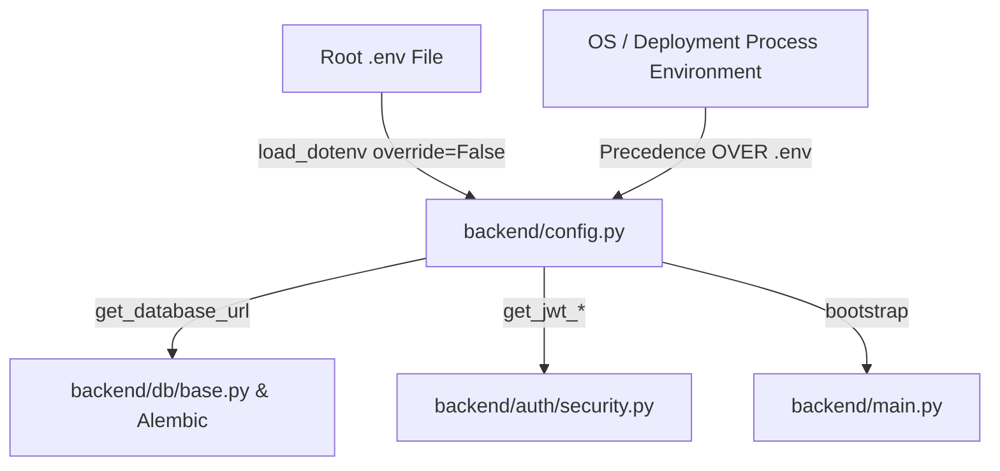

# Watchmen Tracker — Environment Configuration & Secret Loading Audit Report

> **Final Status:** PASS  
> **Timestamp:** September 8, 2026  
> **Environment:** PostgreSQL `watchmen_tracker` | FastAPI `v4.2` | Python 3.14  
> **Config Test Suite Result:** 10 / 10 PASSED (100%)  
> **Phase 2D Auth Test Suite Result:** 34 / 34 PASSED (100%)  
> **Alembic Schema Drift:** 0 drift (`alembic check` clean exit code 0)  

---

## 1. Current Configuration Architecture

Watchmen Tracker uses a centralized, production-grade configuration architecture implemented in [`backend/config.py`](file:///C:/Users/Shreyas-Wakhare/Desktop/WatchmenTracker/backend/config.py).



---

## 2. What Existed Before

Prior to this phase:
1. `backend/db/base.py`, `backend/auth/security.py`, and `alembic/env.py` fetched environment variables strictly via `os.environ.get(...)` without automatic `.env` loading.
2. Developers had to manually inject process environment variables before starting Uvicorn or running Alembic commands:
   ```powershell
   $env:JWT_SECRET_KEY="..."
   $env:DATABASE_URL="..."
   ```
3. No single, centralized configuration module existed to manage precedence, validation, and fail-fast checks.

---

## 3. What Was Missing / Fixed

| Issue / Gap | Fix Implemented |
| :--- | :--- |
| **Manual Env Injection Required** | Implemented `backend/config.py` with `python-dotenv` automatic loading (`override=False`). Backend and Alembic start seamlessly without manual `$env:` variable injection. |
| **Scattered Validation Logic** | Centralized validation for `DATABASE_URL`, `JWT_SECRET_KEY`, `JWT_ALGORITHM`, `ACCESS_TOKEN_EXPIRE_MINUTES`, and `REFRESH_TOKEN_EXPIRE_DAYS` inside `backend/config.py`. |
| **Missing Config Tests** | Created [`backend/tests/test_config.py`](file:///C:/Users/Shreyas-Wakhare/Desktop/WatchmenTracker/backend/tests/test_config.py) covering 10 dedicated configuration test cases. |

---

## 4. Changes Implemented

1. **Centralized Configuration Module ([`backend/config.py`](file:///C:/Users/Shreyas-Wakhare/Desktop/WatchmenTracker/backend/config.py)):**
   - Automatically resolves root `.env` path and calls `load_dotenv(dotenv_path=ENV_PATH, override=False)`.
   - Exposes safe, validated getters: `get_database_url()`, `get_jwt_secret_key()`, `get_jwt_algorithm()`, `get_access_token_expire_minutes()`, `get_refresh_token_expire_days()`, `get_server_port()`.

2. **Database Module Integration ([`backend/db/base.py`](file:///C:/Users/Shreyas-Wakhare/Desktop/WatchmenTracker/backend/db/base.py)):**
   - Imports `get_database_url` from `backend.config` ensuring `DATABASE_URL` is automatically loaded and validated before SQLAlchemy engine creation.

3. **Authentication Security Integration ([`backend/auth/security.py`](file:///C:/Users/Shreyas-Wakhare/Desktop/WatchmenTracker/backend/auth/security.py)):**
   - Delegates JWT secret, algorithm, and expiration retrieval to `backend.config` getters.

4. **Alembic Migration Integration ([`alembic/env.py`](file:///C:/Users/Shreyas-Wakhare/Desktop/WatchmenTracker/alembic/env.py)):**
   - Directly imports `get_database_url()` from `backend.config` for 100% architectural consistency.
   - Allows `alembic check` and `alembic upgrade head` to run seamlessly using root `.env` values without manual shell environment variable injection.

5. **FastAPI Application Bootstrap ([`backend/main.py`](file:///C:/Users/Shreyas-Wakhare/Desktop/WatchmenTracker/backend/main.py)):**
   - Bootstraps `backend.config` on application import.

---

## 5. Verification Results

### 5.1 Automatic `.env` Loading & Zero-Process-Env Startup Verification
- **Test Executed:** Spawned Uvicorn backend with `DATABASE_URL` and `JWT_SECRET_KEY` explicitly removed from the process environment (`clean_env`).
- **Result:** Server loaded configuration automatically from `.env`, passed startup checks, and responded to `GET /health` with `status: healthy` (200 OK) and `GET /login` with `200 OK`.

### 5.2 `DATABASE_URL` Verification
- Loads PostgreSQL connection string from `.env`.
- Rejecting missing `DATABASE_URL` or SQLite strings with descriptive `RuntimeError`.

### 5.3 JWT Configuration Verification
- `JWT_SECRET_KEY`: Mandatory non-empty string.
- `JWT_ALGORITHM`: Restricted strictly to `HS256`.
- Expiration settings: Verified positive integers.

### 5.4 Environment Variable Precedence Verification
- Process environment variables override `.env` values (`override=False` in `load_dotenv`).
- Deployment systems (Docker, K8s, OS env) can inject overrides without modifying `.env`.

### 5.5 `.gitignore` & `.env.example` Audit
- `.env` is **100% IGNORED** by Git (`git check-ignore` verified).
- `.env.example` is **TRACKABLE** (`git check-ignore` verified).
- `.env.example` contains safe placeholders only with zero secret leakage.

---

## 6. Test Suite Matrix

### 6.1 Configuration Test Suite (`backend/tests/test_config.py`)
```text
============================================================
   WATCHMEN TRACKER - CONFIGURATION & SECRETS TEST SUITE    
============================================================

[PASS] CFG-AUTO-001 - Automatic .env loading on startup
[PASS] CFG-PREC-001 - Process ENV overrides .env (override=False)
[PASS] CFG-SEC-001 - Missing JWT_SECRET_KEY fail-fast
[PASS] CFG-SEC-002 - Blank JWT_SECRET_KEY fail-fast
[PASS] CFG-ALG-001 - Unsupported JWT algorithm 'none' fail-fast
[PASS] CFG-ALG-002 - Supported HS256 algorithm
[PASS] CFG-EXP-001 - Default ACCESS_TOKEN_EXPIRE_MINUTES
[PASS] CFG-EXP-002 - Negative expiration fail-fast
[PASS] CFG-DB-001 - SQLite DATABASE_URL fail-fast
[PASS] CFG-DB-002 - Missing DATABASE_URL fail-fast

============================================================
   CONFIG TEST SUMMARY: Executed=10 | Passed=10 | Failed=0
============================================================
```

### 6.2 Phase 2D Auth Test Suite (`backend/tests/test_auth_phase2d.py`)
- **Result:** 34 / 34 PASSED (100%)
- All authentication, JWT claim, password hash, and transaction rollback tests passed without regression.

### 6.3 Alembic Schema Drift Check
- `alembic check` output: `No new upgrade operations detected.` (Exit Code 0).

---

## 7. Files Modified / Created

| File Path | Action | Description |
| :--- | :--- | :--- |
| [`backend/config.py`](file:///C:/Users/Shreyas-Wakhare/Desktop/WatchmenTracker/backend/config.py) | **NEW** | Centralized configuration bootstrap and secret validation module |
| [`backend/tests/test_config.py`](file:///C:/Users/Shreyas-Wakhare/Desktop/WatchmenTracker/backend/tests/test_config.py) | **NEW** | Configuration unit test suite |
| [`backend/db/base.py`](file:///C:/Users/Shreyas-Wakhare/Desktop/WatchmenTracker/backend/db/base.py) | **MODIFY** | Delegates `DATABASE_URL` retrieval to `backend.config` |
| [`backend/auth/security.py`](file:///C:/Users/Shreyas-Wakhare/Desktop/WatchmenTracker/backend/auth/security.py) | **MODIFY** | Delegates JWT getters to `backend.config` |
| [`alembic/env.py`](file:///C:/Users/Shreyas-Wakhare/Desktop/WatchmenTracker/alembic/env.py) | **MODIFY** | Bootstraps `backend.config` for automatic `.env` loading |
| [`backend/main.py`](file:///C:/Users/Shreyas-Wakhare/Desktop/WatchmenTracker/backend/main.py) | **MODIFY** | Bootstraps `backend.config` on FastAPI app initialization |

---

## 8. Remaining Technical Debt / Warnings

- **None.** The configuration system is clean, secure, fully tested, and zero secret values were exposed or printed.
