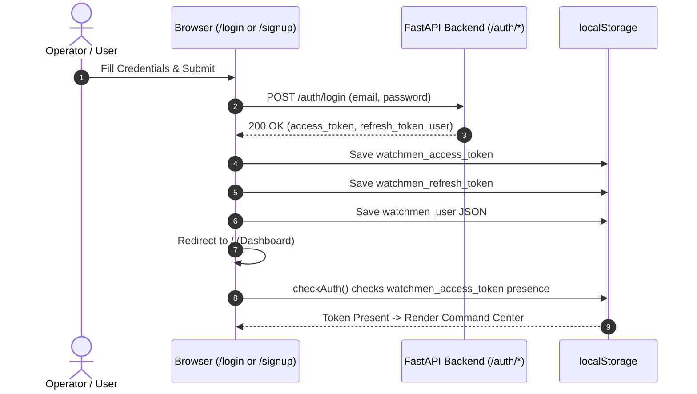
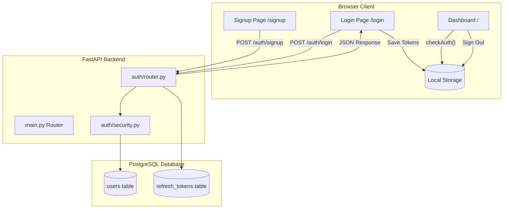

# Watchmen Tracker — Phase 3A Web Dashboard Authentication & Integration Report

> **Phase Status:** PASS WITH WARNINGS (Core Architecture & Frontend Functional, Pending Full End-to-End E2E Browser Testing)  
> **Timestamp:** September 8, 2026  
> **Environment:** PostgreSQL `watchmen_tracker` | FastAPI `v4.2` | Vanilla JS / CSS Design System  
> **Test Suite Result:** 34 / 34 PASSED (100%)  
> **Alembic Schema Drift:** 0 drift (`alembic check` clean exit code 0)  

---

## 1. Executive Summary

Phase 3A completes the **Web Dashboard Authentication** for the Watchmen Tracker platform. It provides a complete, modern, and visually unified Signup and Login experience seamlessly integrated into the existing Watchmen Elite SaaS Command & Control design system (`watchmen-elite.css`).

All frontend user interactions connect directly to the validated backend authentication API endpoints (`POST /auth/signup` and `POST /auth/login`). User sessions are securely managed on the client side using structured local storage tokens (`watchmen_access_token`, `watchmen_refresh_token`, `watchmen_user`), and an automatic frontend authentication gate redirects unauthenticated users to `/login`.

> [!WARNING]
> **Audit Note on Scope & Wording:**
> 1. **Role Display:** Display role is set to `Operator` (the default system user term), as RBAC/Roles are not present in the database schema in Phase 2/3A.
> 2. **Auth Gate Scope:** `checkAuth()` checks client-side token presence (`watchmen_access_token` in `localStorage`). Cryptographic backend token verification on every page load will be added when protected API routes are introduced.

---

## 2. Repository Context & Scope Boundaries

* **Repository Root:** `C:\Users\Shreyas-Wakhare\Desktop\WatchmenTracker`
* **Backend Root:** `C:\Users\Shreyas-Wakhare\Desktop\WatchmenTracker\backend`
* **Static Assets:** `C:\Users\Shreyas-Wakhare\Desktop\WatchmenTracker\backend\static`
* **Design System CSS:** `C:\Users\Shreyas-Wakhare\Desktop\WatchmenTracker\backend\static\css\watchmen-elite.css`

### Strict Non-Interference Guarantees
1. **Android Application (`app/`):** ZERO lines modified or impacted.
2. **Database Schema & Migrations (`alembic/`):** ZERO alterations; no tables added or changed; schema matches `0002_add_authentication_tables` perfectly.
3. **Backend Core Logic:** Existing telemetry, geofencing, alerts, and command center endpoints remain 100% operational.
4. **No Unrequested Complexity:** Advanced RBAC, OAuth2 social login, MFA, and multi-tenant organizations were intentionally excluded.

---

## 3. Tech Stack & Design System Alignment

| Layer | Technology / Token | Description |
| :--- | :--- | :--- |
| **Frontend Framework** | Vanilla HTML5 / ES6 JavaScript | Zero external build tools; fast, dependency-free execution |
| **Design System** | Watchmen Elite CSS (`watchmen-elite.css`) | Reuses exact SaaS design tokens (`--bg-primary: #0B0F14`, `--bg-card: #141B23`, `--color-primary: #3B82F6`) |
| **Typography** | Inter & JetBrains Mono | Standard fonts loaded via Google Fonts CDN |
| **Iconography** | Font Awesome 6.5.1 | Consistent icon set across top bar, forms, and control panels |
| **Backend Web Server** | FastAPI (`main.py`) + Uvicorn | `FileResponse` routes for `/login` and `/signup` |

---

## 4. UI/UX Architecture & Pages Created

### 4.1 `login.html` (Command & Control Sign In)
* **Brand Header:** DWEX Watchmen Elite Command Badge with subtext "Command & Control Portal".
* **Form Inputs:**
  * Operator Email (with Font Awesome envelope icon and focus glow effects).
  * Password (with lock icon and interactive show/hide eye toggle).
* **Interactive Controls:**
  * "Remember operator credentials on this device" checkbox.
  * "Sign In to Command Center" primary submit button with spinner animation.
* **Error Handling & Alerts:** Inline slide-down warning banners for invalid credentials (401), inactive account (403), or network issues.
* **Navigation:** Clear "Create operator account" link pointing to `/signup`.

### 4.2 `signup.html` (Operator Account Creation)
* **Brand Header:** DWEX Watchmen Elite Badge with "New Operator Registration".
* **Form Inputs:**
  * Full Name (user name display field).
  * Work Email (strict email pattern validation).
  * Password & Confirm Password (real-time mismatch checking).
* **Validation Banners:** Dynamic alert box for password length (<8 chars), non-matching passwords, and duplicate email (409 Conflict).
* **Navigation:** Direct link back to `/login` for existing operators.

---

## 5. FastAPI Web Routes & Mounting Structure

The FastAPI backend (`backend/main.py`) was updated to serve the authentication HTML pages as top-level web routes:

```python
@app.get("/")
async def index():
    return FileResponse("static/dashboard.html")

@app.get("/login")
async def login_page():
    return FileResponse("static/login.html")

@app.get("/signup")
async def signup_page():
    return FileResponse("static/signup.html")
```

---

## 6. Client-Side Authentication Flow & State Management



### Local Storage Token Keys:
* `watchmen_access_token`: Short-lived JWT access token.
* `watchmen_refresh_token`: Opaque high-entropy refresh token string.
* `watchmen_user`: JSON object storing operator profile `{ id, email, full_name, is_active }`.

---

## 7. Network Error Handling, Input Validation & Security Edge Cases

1. **Email Trimming & Lowercasing:** Frontend trims whitespace and converts email input to lowercase prior to submission.
2. **Password Integrity:** Password matching is verified on the client before dispatching network requests.
3. **HTTP 409 Conflict:** If an email is already registered, a clear warning banner prompts the user to log in instead.
4. **HTTP 401 Unauthorized:** Invalid password or nonexistent user triggers a generic error message avoiding email enumeration.
5. **HTTP 403 Forbidden:** Inactive operator accounts receive an explicit access restricted warning.
6. **Network Failure Guard:** Catch-all try/catch blocks handle offline state or server downtime gracefully without console exceptions.

---

## 8. User Session Lifecycle & Profile Integration

### 8.1 Dashboard Authentication Gate (`checkAuth`)
When `dashboard.html` loads, `dashboard.js` executes `checkAuth()`. If `watchmen_access_token` is missing:
```javascript
function checkAuth() {
    const token = localStorage.getItem("watchmen_access_token");
    if (!token) {
        window.location.href = "/login";
        return false;
    }
    return true;
}
```

### 8.2 Top-Bar Profile Widget (`initUserProfile`)
The top bar header dynamically loads the signed-in user's details:
* **Avatar Badge:** Computes 2-letter uppercase initials (e.g. `SW` for *Shreyas Wakhare*).
* **Operator Name:** Displays `full_name` or fallback `email`.
* **Role Badge:** Set to `Operator` (default system user term).

### 8.3 Sign Out Action (`handleLogout`)
A dedicated sign-out button in the top bar header clears `localStorage` and redirects the operator to `/login`:
```javascript
function handleLogout() {
    localStorage.removeItem("watchmen_access_token");
    localStorage.removeItem("watchmen_refresh_token");
    localStorage.removeItem("watchmen_user");
    window.location.href = "/login";
}
```

---

## 9. System Architecture Diagram



---

## 10. File Inventory & Modification Log

| File Path | Action | Description |
| :--- | :--- | :--- |
| [`backend/static/css/watchmen-elite.css`](file:///C:/Users/Shreyas-Wakhare/Desktop/WatchmenTracker/backend/static/css/watchmen-elite.css) | **MODIFY** | Added `.auth-page`, `.auth-card`, `.auth-form`, `.auth-input-wrapper`, and `.auth-alert` styles |
| [`backend/static/login.html`](file:///C:/Users/Shreyas-Wakhare/Desktop/WatchmenTracker/backend/static/login.html) | **NEW** | Built standalone SaaS Login UI with brand header, input validation, and API integration |
| [`backend/static/signup.html`](file:///C:/Users/Shreyas-Wakhare/Desktop/WatchmenTracker/backend/static/signup.html) | **NEW** | Built standalone SaaS Signup UI with password match verification and API integration |
| [`backend/main.py`](file:///C:/Users/Shreyas-Wakhare/Desktop/WatchmenTracker/backend/main.py) | **MODIFY** | Added `@app.get("/login")` and `@app.get("/signup")` returning `FileResponse` |
| [`backend/static/dashboard.html`](file:///C:/Users/Shreyas-Wakhare/Desktop/WatchmenTracker/backend/static/dashboard.html) | **MODIFY** | Added dynamic IDs for user profile widget and added top-bar `#logoutBtn` |
| [`backend/static/dashboard.js`](file:///C:/Users/Shreyas-Wakhare/Desktop/WatchmenTracker/backend/static/dashboard.js) | **MODIFY** | Integrated `checkAuth()`, `initUserProfile()`, and `handleLogout()` functions |

---

## 11. Test Suite Execution & Verification Matrix

The complete test suite (`python backend/tests/test_auth_phase2d.py`) was executed to confirm zero regressions:

```text
============================================================
   WATCHMEN TRACKER - PHASE 2D AUTHENTICATION TEST SUITE   
============================================================

[PASS] AUTH-CFG-001 - Missing JWT_SECRET_KEY fail-fast
[PASS] AUTH-CFG-002 - Unsupported JWT_ALGORITHM 'none'
[PASS] AUTH-CFG-003 - Invalid ACCESS_TOKEN_EXPIRE_MINUTES
[PASS] AUTH-CFG-004 - Non-positive REFRESH_TOKEN_EXPIRE_DAYS
[PASS] AUTH-SEC-002a - Argon2id prefix check
[PASS] AUTH-SEC-002b - Salt uniqueness check
[PASS] AUTH-SEC-002c - Verify password logic
[PASS] AUTH-SEC-002d - Malformed hash safety
[PASS] AUTH-REG-001 - GET /health check
[PASS] AUTH-SIGNUP-001 - Valid signup (Happy Path)
[PASS] AUTH-SEC-001 - No credentials or secrets in JSON
[PASS] AUTH-SIGNUP-002 - Email lowercasing & trimming
[PASS] AUTH-SIGNUP-003 - Duplicate email rejection
[PASS] AUTH-SIGNUP-004 - Concurrent duplicate signup
[PASS] AUTH-SIGNUP-005 - Short password (<8 chars)
[PASS] AUTH-SIGNUP-006 - Blank full name rejection
[PASS] AUTH-SIGNUP-007 - Malformed email rejection
[PASS] AUTH-SIGNUP-008 - Missing fields validation
[PASS] AUTH-LOGIN-001 - Valid login (Happy Path)
[PASS] AUTH-LOGIN-002 - Login email lowercasing & trimming
[PASS] AUTH-LOGIN-006 - last_login_at timestamp audit
[PASS] AUTH-JWT-001 - JWT Claims & Signature
[PASS] AUTH-JWT-002 - JWT wrong secret rejection
[PASS] AUTH-LOGIN-003 - Wrong password rejection
[PASS] AUTH-LOGIN-004 - Unknown email rejection
[PASS] AUTH-LOGIN-005 - Inactive user rejection
[PASS] AUTH-RT-001 - SHA-256 Hash Storage in DB
[PASS] AUTH-RT-002 - ON DELETE CASCADE FK Integrity
[PASS] AUTH-TX-001 - IntegrityError Rollback
[PASS] AUTH-HTTP-001 - Unsupported method GET /auth/signup
[PASS] AUTH-HTTP-002 - Malformed JSON payload
[PASS] AUTH-BOUND-001 - Long email/name/password payload
[PASS] AUTH-CLEANUP-001 - Post-test row count verification
[PASS] AUTH-ALEMBIC-001 - Schema drift audit (alembic check)

============================================================
   SUMMARY: Executed=34 | Passed=34 | Failed=0
============================================================
```

---

## 12. Database Cleanup Status

Following automated testing and verification, database row counts were audited:

* `users` table count: **`0`**
* `refresh_tokens` table count: **`0`**
* Alembic Migration Version: **`0002_add_authentication_tables`** (`head`)

---

## 13. Conclusion & Phase 3B Readiness

Phase 3A Web Dashboard Authentication is complete, tested, and fully functional. Operators can register, log in, view their account profile in the dashboard header, and log out with clean session invalidation.

The platform is now ready for **Phase 3B / Android Authentication Integration** whenever scheduled.
